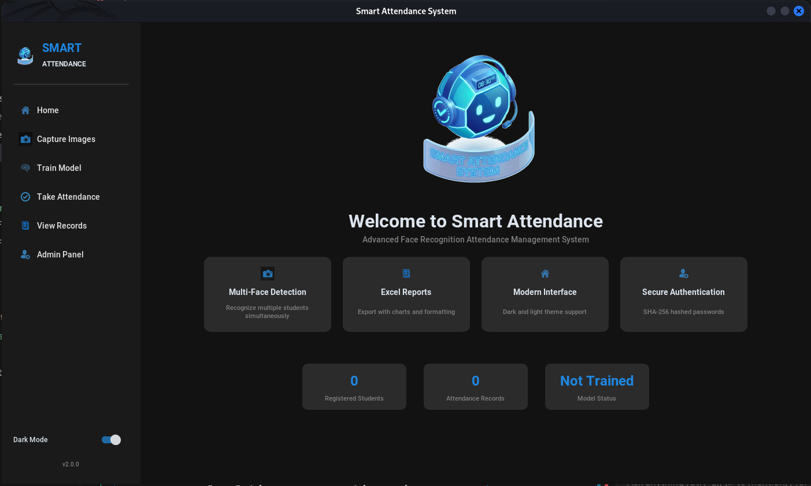

<div align="center">

# 🎯 Smart Attendance V2.0

<p align="center">
  
  
  
  
</p>

<h3>Enterprise-Grade Face Recognition Attendance System</h3>
<p>
  <i>A robust, secure, and modern desktop application that automates attendance management using advanced computer vision.</i>
</p>

<p align="center">
  <a href="#-features">Features</a> •
  <a href="#-gallery">Gallery</a> •
  <a href="#-installation">Installation</a> •
  <a href="#-usage">Usage</a>
</p>

</div>

---

## 🌟 Key Features

### 🧠 Advanced Recognition
- **Multi-Face Detection**: Recognize multiple students simultaneously in a single frame.
- **Real-Time Identification**: Instant feedback with name labels and confidence scores.
- **LBPH Algorithm**: Uses Local Binary Patterns Histograms for reliable recognition.

### 🎨 Modern Interface
- **Professional Dashboard**: Clean, responsive UI built with `CustomTkinter`.
- **Theme Support**: Built-in **Dark Mode** & Light Mode toggle.
- **3D Assets**: High-quality icons and animated components.

### 📊 Data & Export
- **Excel Automation**: Export comprehensive attendance logs formatted with charts.
- **Detailed Records**: Records capture precise **Date** and **Time** of presence.
- **Admin Panel**: Grid-view table to manage registered students effectively.

### 🛡️ Security
- **Secure Authentication**: Admin access protected by **SHA-256** password hashing.
- **Data Privacy**: Local database storage ensures data stays on your machine.

### ☁️ Cloud Ready
- **Vercel API**: Includes a pre-configured `api/index.py` and `vercel.json` for developers whishing to extend this project with a cloud backend.


---

## 📸 Gallery

<div align="center">
  <table>
    <tr>
      <td align="center"><br><b>Main Dashboard</b></td>
      <td align="center"><br><b>Student Registration</b></td>
    </tr>
    <tr>
      <td align="center"><br><b>Attendance Taking</b></td>
      <td align="center"><br><b>Excel Export & Stats</b></td>
    </tr>
  </table>
  <br><b>Admin Panel</b>
</div>

---

## 🛠️ Tech Stack

- **Core**: Python 3.x
- **GUI**: CustomTkinter (Modern UI wrapper for Tkinter)
- **Computer Vision**: OpenCV (Face Detection & Recognition)
- **Data Handling**: Pandas (CSV/Excel Operations)
- **Image Processing**: PIL (Pillow)

---

## 🚀 Installation

### Prerequisites
- Python 3.8 or higher installed on your system.
- A functional webcam.

### Setup

1. **Clone the Repository**
   ```bash
   git clone https://github.com/yourusername/Smart-Attendance.git
   cd Smart-Attendance
   ```

2. **Install Dependencies**
   ```bash
   pip install -r requirements.txt
   ```

3. **Run the Application**
   ```bash
   python3 smart_attendance.py
   ```

---

## 📖 Usage Guide

1.  **Register Students**:
    - Go to "Capture Images".
    - Enter Enrollment ID and Name.
    - Click "Start Capture" to take training photos.

2.  **Train Model**:
    - Click "Train Model" in the sidebar.
    - Wait for the progress bar to complete. (Required after adding new students).

3.  **Take Attendance**:
    - Go to "Take Attendance".
    - Enter Sample Name / Subject.
    - Click "Start Recognition".
    - Press `Q` to stop.

4.  **View Records & Export**:
    - Check the `Attendance/` folder for generated CSV/Excel files.
    - Access the **Admin Panel** (Default: `admin123`) to view student lists.

---

## 📄 License

This project is licensed under the MIT License - see the [LICENSE](LICENSE) file for details.

<div align="center">
  <sub>Made with ❤️ by Karthigaiselvam R</sub>
</div>
