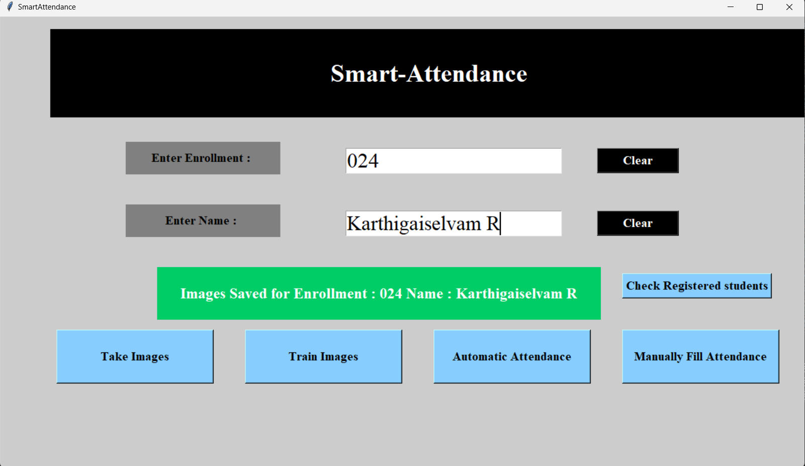
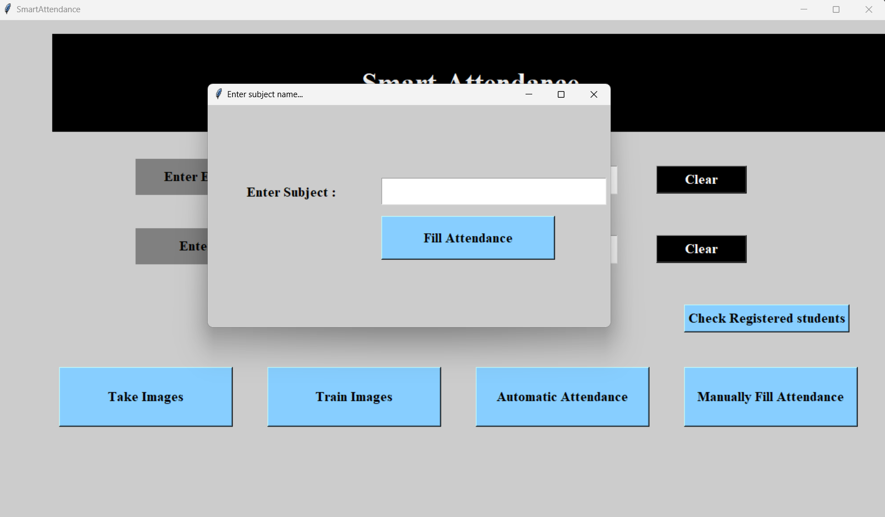

<div align="center">

# 🎯 Smart Attendance Management System

<p align="center">
  
  
  
  
</p>

<p align="center">
  <strong>🚀 An intelligent face recognition-based attendance management system that automates the tedious process of manual attendance taking.</strong>
</p>

<p align="center">
  <a href="#-features">Features</a> •
  <a href="#-screenshots">Screenshots</a> •
  <a href="#-installation">Installation</a> •
  <a href="#-usage">Usage</a> •
  <a href="#-tech-stack">Tech Stack</a>
</p>

---

</div>

## ✨ Features

| Feature | Description |
|---------|-------------|
| 🎭 **Face Detection** | Real-time face detection using Haar Cascade Classifier |
| 🧠 **Face Recognition** | LBPH (Local Binary Patterns Histograms) algorithm for accurate recognition |
| 📸 **Image Capture** | Capture and store 70+ images per student for robust training |
| 🤖 **Automatic Attendance** | Auto-fill attendance by recognizing faces via webcam |
| ✍️ **Manual Attendance** | Option to manually fill attendance when needed |
| 📊 **CSV Export** | Export attendance records to CSV files |
| 🗄️ **Database Storage** | MySQL database integration for persistent storage |
| 👨‍💼 **Admin Panel** | Secure admin login to view registered students |

---

## 📸 Screenshots

<div align="center">

### 🏠 Main Dashboard


*The main interface with options for image capture, training, and attendance filling*

---

### 📷 Face Capture & Registration


*Capturing face images for a new student registration*

---

### 🎓 Training the Model


*Training the face recognition model with captured images*

---

### ✅ Automatic Attendance


*Real-time face recognition and automatic attendance marking*

---

### 📋 Attendance Records


*Viewing the generated attendance records*

</div>

---

## 🛠️ Tech Stack

<div align="center">

| Technology | Purpose |
|------------|---------|
|  | Core Programming Language |
|  | Computer Vision & Face Detection |
|  | Numerical Computing |
|  | Data Manipulation |
|  | Database Management |
|  | GUI Framework |

</div>

---

## 📦 Installation

### Prerequisites

Ensure you have Python 3.7+ installed on your system.

### Step 1: Clone the Repository

```bash
git clone https://github.com/Karthigaiselvam-R-official/Smart_Attendance.git
cd Smart_Attendance
```

### Step 2: Install Dependencies

```bash
pip install opencv-python
pip install opencv-contrib-python
pip install numpy
pip install pandas
pip install pillow
pip install pymysql
```

### Step 3: Setup MySQL Database

1. Install and start MySQL server
2. Create two databases:
   ```sql
   CREATE DATABASE Face_reco_fill;
   CREATE DATABASE manually_fill_attendance;
   ```

### Step 4: Create Required Folders

Ensure the following folders exist:
```
📁 SmartAttendance/
├── 📁 TrainingImage/          # Stores captured face images
├── 📁 TrainingImageLabel/     # Stores trained model
├── 📁 StudentDetails/         # Stores student information CSV
└── 📁 Attendance/             # Stores attendance records
```

---

## 🚀 Usage

### Running the Application

```bash
python AMS_Run.py
```

### Workflow


1. **Register a Student**
   - Enter the student's enrollment number and name
   - Click "Take Images" to capture 70+ face images

2. **Train the Model**
   - Click "Train Images" to train the LBPH recognizer
   - Wait for the "Model Trained" confirmation

3. **Take Attendance**
   - **Automatic**: Click "Automatic Attendance", enter subject name, and let the system recognize faces
   - **Manual**: Click "Manually Fill Attendance" for manual entry

4. **View Records**
   - Admin Login: Username: `SmartAttendance` | Password: `SmartAttendance@FDS`
   - Check attendance CSV files in the `Attendance` folder

---

## 📁 Project Structure

```
📦 SmartAttendance
├── 📜 AMS_Run.py                           # Main application file
├── 📜 training.py                          # Training script
├── 📜 testing.py                           # Testing utilities
├── 📜 haarcascade_frontalface_default.xml  # Haar cascade classifier
├── 📜 haarcascade_frontalface_alt.xml      # Alternative classifier
├── 📁 TrainingImage/                       # Student face images
├── 📁 TrainingImageLabel/                  # Trained model (.yml)
├── 📁 StudentDetails/                      # Student info CSV
├── 📁 Attendance/                          # Attendance records
└── 📁 screenshots/                         # Application screenshots
```

---

## 🔧 How It Works

<div align="center">

```
┌─────────────────┐    ┌─────────────────┐    ┌─────────────────┐
│  Face Detection │ => │  Face Encoding  │ => │  Recognition    │
│  (Haar Cascade) │    │     (LBPH)      │    │  & Attendance   │
└─────────────────┘    └─────────────────┘    └─────────────────┘
```

</div>

1. **Detection**: Uses Haar Cascade Classifier to detect faces in real-time
2. **Encoding**: LBPH algorithm creates unique face encodings for each student
3. **Recognition**: Compares live faces with stored encodings to identify students
4. **Recording**: Automatically logs attendance with timestamp to CSV and MySQL

---

## ⚠️ Important Notes

> **Camera Access**: Ensure your webcam is properly connected and accessible
> 
> **Lighting**: Good lighting conditions improve recognition accuracy
> 
> **Database**: MySQL server must be running for attendance storage

---

## 🤝 Contributing

Contributions are welcome! Please feel free to submit a Pull Request.

1. Fork the project
2. Create your feature branch (`git checkout -b feature/AmazingFeature`)
3. Commit your changes (`git commit -m 'Add some AmazingFeature'`)
4. Push to the branch (`git push origin feature/AmazingFeature`)
5. Open a Pull Request

---

## 📄 License

This project is licensed under the MIT License - see the [LICENSE](LICENSE) file for details.

---

<div align="center">

### ⭐ Star this repository if you found it helpful!

**Made with ❤️ for Smart Attendance Management**

</div>
